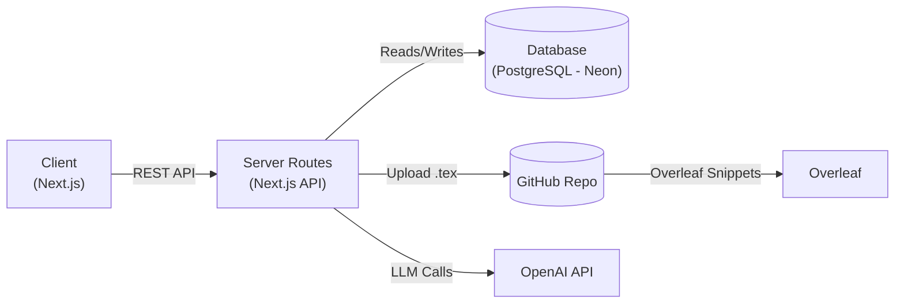

# Resume Optimizer

AI-assisted LaTeX resume tailoring workspace. Resume Optimizer lets you manage
multiple templates and prompts, paste a job description, generate a tailored
resume, and get an Overleaf link, all in one UI.

## Overview

Resume Optimizer is built for rapid, repeatable resume customization:
- Manage LaTeX templates and prompt profiles per user
- Generate tailored resume content from a job description
- Store outputs in GitHub and open in Overleaf
- Track runs in a history view
- Securely store API credentials (encrypted)

## Usage

- Paste a job description and click Generate to get an Overleaf link.
- Manage templates, prompts, GitHub, and OpenAI profiles in Settings.
- View and reopen past outputs in History.

## Website

- https://resumeoptimizer-xnee.onrender.com

## Architecture



## Tech Stack

- Frontend: Next.js, React, TypeScript, Tailwind, shadcn/ui
- Backend: Next.js API routes, Drizzle ORM
- Auth: NextAuth (JWT)
- DB: PostgreSQL (Neon)
- Storage: GitHub (tex output), Overleaf link
- AI: OpenAI

## AI Assistant (OpenAI)

Set these env vars:

- `OPENAI_API_KEY` (required if not storing per-user OpenAI profiles)
- `OPENAI_MODEL` (optional, defaults to `gpt-4o-mini`)

## Local Setup (Brief)

1) Install dependencies
```bash
npm install
```

2) Configure env vars
```bash
# .env.local
DATABASE_URL=postgres://...
NEXTAUTH_URL=http://localhost:3000
NEXTAUTH_SECRET=your_secret
ENCRYPTION_KEY=base64_32_byte_key
OPENAI_API_KEY=your_openai_key
OPENAI_MODEL=gpt-4o-mini
```

3) Run the app
```bash
npm run dev
```

## Key User Flows

- Templates: add/edit/delete templates, set default.
- Prompts: add/edit/delete prompt profiles, set default.
- Generation: paste JD, select template/prompt, generate, open Overleaf.
- History: review runs, open GitHub/Overleaf links, view JD.

## Notes

- New accounts seed a default template and prompt from `src/seed/`.
- GitHub/OpenAI profiles are per-user and encrypted at rest.

---

**Last Updated:** January 22, 2026
**Version:** 1.0.0
